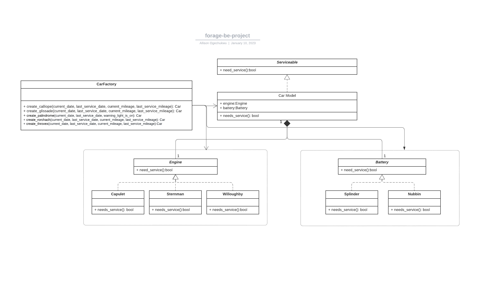

# forage virtual internship in backend engineering

Introduction to concepts like:

- UML class diagram
- refactoring
- desgin patterns like factory and strategy design patterns

## UML Class Diagram
This is the UML class digram task from the Lyft BE internship that was created for the project with LucidChart.

